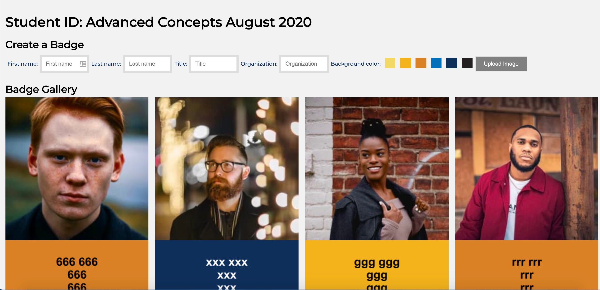
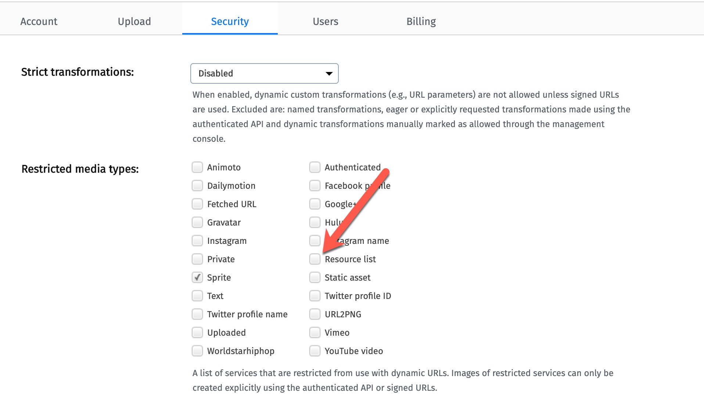

# Virtual ID Badge

<a href="https://badge.cloudinary.training/index.html?cn=djh67gzdu&title=CSM%20Test&date=July%202020&badge=badge2" target="_blank">Demo</a>



You can use your Cloudinary account as a Database for virtual images and information that will go into creating an ID badge.  

This web application can be harnessed to upload customer information to the Cloud and create a web page with all customer image and data made publicly available on the Web.

The script for the Web page will expect a query string with `cn:cloud_name` key/value pair.  The cloud_name supplied represents a Cloudinary cloud specific to a course.  

The current defaults are listed below.  You can override these in the query string.
- CLOUD_NAME/cn: djh67gzdu
- COURSE_TITLE/title: Cloudinary
- COURSE_DATE/date: 2020
- BADGE/badge: badge

The steps to prepare for for using this app are: 

1. Create a Cloudinary cloud.  Copy the CLOUDINARY_URL into a .env file.
2. Run `npm i` to install libraries.
3. Run the script `create-badge-preset.js`.  This script sets up instructions for cropping, folder-ing and tagging the images uploaded.  note: The upload script will also add user supplied context data and require that the image uploaded contains a face.  The folder and tag are the same which is whatever value is given to badge: **badge**.  You can run this multiple times in a single cloud account using different badge values to create different directories and image sets.
```bash
node create-badge-preset.js
```
4. Run the script `create-named-badge-xform-color.js`. This script will create the transformation that will overlay student supplied data: name, title, organization to the badge, as well as apply background and foreground color to the student information.  You only need to run this once per cloud account.
```bash
node create-named-badge-xform-color.js
``` 

5. Supply a URL to students for a particular course like this: 
```bash
https://badge.cloudinary.com/index.html?cn=cloud_name&title=course%20title&date=course%20date&badge=mybadge
```
Use the Cloud Name for the cloud you created in step 1 for **cn**.  Add a URL encoded string for **title** and **date**.  The title and date should show up in your header.  

6. We are adding a version with current epoch time to bust the cache so that we can pick up new images with the **badge** tag without running into caching problems.  
You can also accomplish cache busting with a setting in your cloud.  You need to get support to help with that and it shouldn't be necessary. Cloudinary admin cloud setting for list sync: 

7. In order to use the list API which gathers up images by tag (**badge**), you need to uncheck the list resources in settings | security.

8. The app upload widget is configured to only look for `png` and `jpeg` file types.  It allows you to use these sources: local file system, url, camera and facebook.

## Example:
To use the following specifications for collecting data:
- cloud name: `djh67gzdu`
- course title: Student ID Test
- course date: July 2020
- badge: badge2

Use the following URL

https://badge.cloudinary.training/index.html?cn=djh67gzdu&title=CSM%20Test&date=July%202020&badge=badge2


